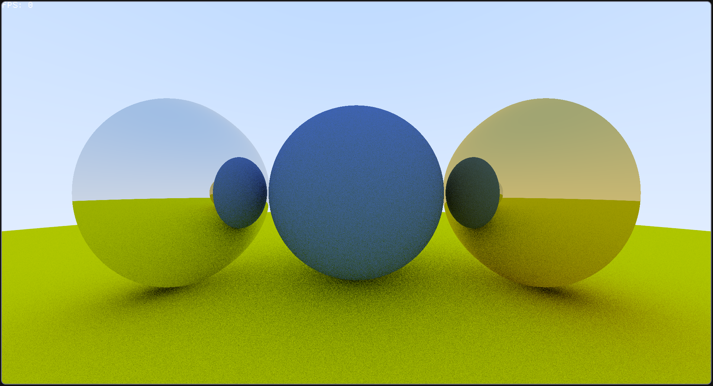

# Project description

Raytracer in macroquad, running on cpu, following raytracing in one weekend tutorial.
Made me start my bevy_voxel project (separate repo) and learn more about vectors, and even geometric algebra

## How to run

Make sure to run in release mode, because the raytracer is very slow ! (`cargo r -r`)

