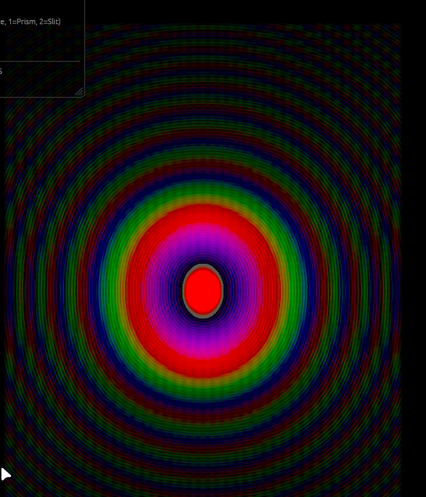
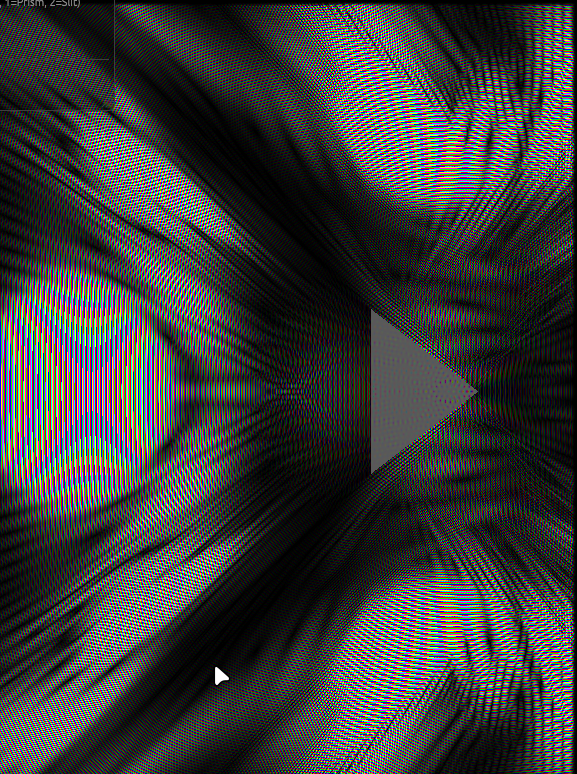

# Project description

Some simulations made using the cuneus rust engine
It allows to make compute shaders easily.
So you can make your own renderer + physics simulations

The project contains a n-body particle simulator, a fluid simulation, a wave simulation

And most importantly a wave schrodinger simulation, using the leap-frog euler method.

## How to run

`cargo run` works, and you can change the executed file at the end in main.rs.
If you select the wave schrodinger simulation, you can change the parameters of the simulation using the following arguments:
An example of prism that looks cool
```bash
cargo run -- --freq 1500.0 --size 0.025 --potential "step(0.1, max(-triangle((uv-vec2(0., 0.2))*8.0), 0.))"
```
Quantum tunneling !
```bash
cargo r -- --freq 1500 --size 0.045 --potential "1.0-step(0.01, abs(uv.y-0.2))*1.0"
```
Or a simple circular trap:
```bash
cargo r -- --freq 700 --size 0.015 --potential "pow(length(uv+vec2(0., 0.2))*10., 3)"
```
Random potential:
```bash
cargo r -- --freq 700 --size 0.015 --potential "random(sin(f32(pos.x))+cos(f32(pos.y)*100000.1313)+time_data.time)*0.5"
```


Freq and size are interpreted as numbers, but potential is code, which has access to the "uv" variable, which is the coordinate of the cell (distance from origin).
And potential code is getting replaced raw in the shader code, so you can play with anything.

You can try release mode if you are CPU-bounded... For this just change the iteration count in the code and run in release mode: `cargo run --release`
I get ~40fps in release mode with 50 iterations whereas I get 25fps in debug
But with 20 iterations, it's ~60fps in debug mode.

TODO: Change wave form from cli

## Results
I got a lot of great results, but I haven't kept track of all of them... But any configuration will lead to mind blowing visuals !
By the way, it's not so complicated to change the shader code to make any other simulation (change brightness, ...) => It has hot reloading !




